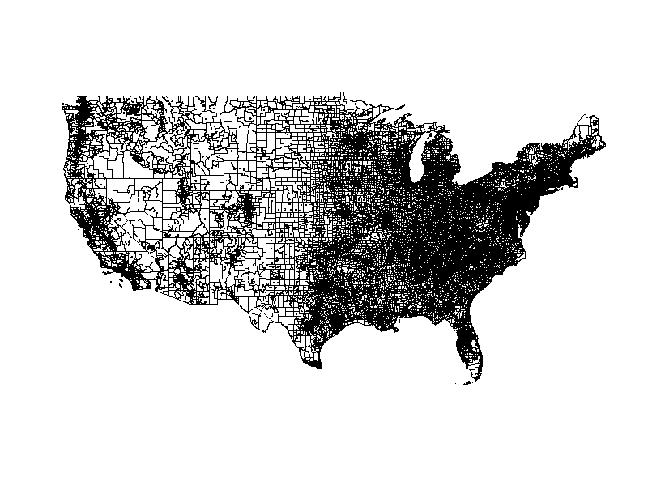
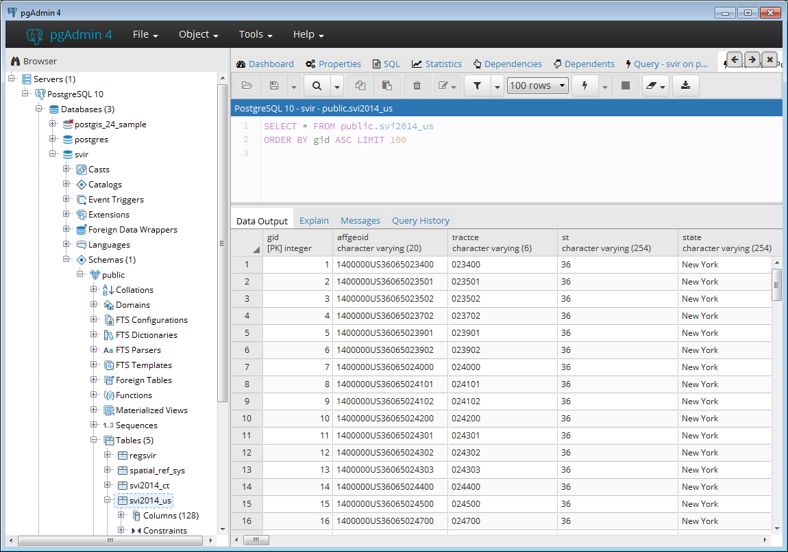

```{r html_doc, eval=FALSE, include=FALSE}
library(rmarkdown)
render(input = "Leung-Pschorr-SVI.Rmd", output_format = "html_document", output_file = "Leung-Pschorr-SVI.html")
```

```{r setup, include=FALSE}
knitr::opts_chunk$set(echo = TRUE)
library(knitr)
``` 

## Social Vulnerability

<br></br>

1. "Social vulnerability refers to the **resilience of communities** when confronted by external stresses..." [(ATSDR 2013)](https://svi.cdc.gov/)
    + Degree of resilience (or lack thereof) stemming from socioeconomic factors
    + Not geophysical qualities
    
2. Difficult to quantify
    + Different definitions across various sectors
    + Multitude of contributing factors
    + Reaction between socioeconomic qualities

3. Social Vulnerability Index (SVI)
    + Jointly developed by Centers for Disease Control and Prevention (CDC) and the Agency for Toxic Substances and Disease Registry (ATSDR)
    + Multi-level approach to quantifying social vulnerability
    + Complex index to measure complex phenomena

## The Social Vulnerability Index - Background

<br></br>

1. Built upon [(Cutter et al. 2003)](http://www.geo.mtu.edu/volcanoes/06upgrade/Social-KateG/Attachments%20Used/VulnerabilityEnvironmentalHaz.pdf) work examining "vulnerability as a social condition..."

2. Uses American Community Survey (ACS) 2010-2014 5-Year Estimates 
   
3. Multiple versions of the index
    + 2000, 2010, and 2014
    + This project modifies the 2014 implementation 
    + Examines 2014 ACS variables at the census tract level

4. Currently the authoritative source on SVI within the US

5. Relative ranks/multi-tiered index
    + Variables normalized by population
    + Census tract's SVI value is relative, rather than a direct measure
    + 40 indicators are calculated for every census tract

## The Social Vulnerability Index - Motivation

<br></br>

1. SVI used by emergency/disaster management professionals 
    + Identify potentially less resilient communities in order to help inform disaster preparation, mitigation, and reconstruction policies and undertakings [(ATSDR)](https://svi.cdc.gov/Documents/FactSheet/SVIFactSheet.pdf)

2. State and nationwide scales may obscure local variations in social vulnerability

3. Unnecessary (and inaccurate) to look at state/nationwide SVI rankings for an event affecting a specific region
    + E.g. if an event impacts California, socio-economic resiliance of New England should not affect SVI rankings 
    
4. We aim to create a Shiny web application to calculate SVI on the fly using a user-defined AOI
    + This tackles the current relativity problem of SVI
  
## The Social Vulnerability Index - Data

1. <u><b>15 Aggregate ACS Variables</b></u> (Tier 1)
  
    1.1. <font color="#47d147"> Below poverty,  unemployed, income, no high school diploma</font> 
   
    1.2. <font color="#ffa31a"> Aged 65 or older, aged 17 or younger, civilian with a disability, single-parent   household</font> 
  
    1.3. <font color="#b300b3"> Minority, speak English "Less than Well"</font> 
   
    1.4. <font color="#3366ff"> Multi-unit Structures, mobile homes, crowding, no vehicle, group quarters</font> 
   
To arrive at the index value for each variable, one calculates the <u>precentile rank</u> of the <u>sum</u> of their constituent <u>ACS variables</u>.
   
2. <u><b>Four Thematic Domains</b></u> (Tier 2)
  
    2.1. <font color="#47d147"> Socioeconomic Status</font> 
   
    2.2. <font color="#ffa31a"> Household Composition & Disability</font> 
  
    2.3. <font color="#b300b3"> Minority Status & Language</font> 
   
    2.4. <font color="#3366ff"> Housing & Transportation</font> 

To arrive at the index value for each Thematic Domain, one calculates the <u>percentile rank</u> of the <u>sum</u> of their constituent <u>tier 1 variable percentile ranks</u>.

## The Social Vulnerability Index - Data (continued)

<br></br>

3. Overall SVI Rank (Tier 3) <br></br>
The Overall SVI rank is calculated in following the same methodology as the Thematic Domains. The index value is the percentile rank of the summed Thematic Domains percentile rank values.

<br></br>

<font color="#ED5E11"><center>Equation for Percentile Rank Value:
<i>Percentile Rank</i>  = <u>(Rank - 1) / (N - 1)</u></center></font>

<br></br>

4. Index Variable Flags
      + Higher tiers of the index provide a more genearlized conception of vulnerability by combining variables. This generalization has the unfortunate effect of masking extreme vulnerability in particular variables.
      + Census tracts that rank in the 90th percentile are assigned flags for each element in all three tiers.

## Methods - Dealing with Data

<br></br>

1. Storing Data
    + Nationwide dataset is considerable
    + Providing a service - consider the user
    + By design, the user will not need the full dataset
    
##

<center>
72,842 Census Tracts, <br></br> 126 Columns of Information, 1 Column of Vector Geometry
<br></br>

```{r, out.width = "900px", echo=FALSE}

```

423MB
</center>

## Methods - Dealing with Data

<br></br>

1. Storing Data
    + Nationwide dataset is considerable
    + Providing a service - consider the user
    + By design, the user will not need the full dataset

2. PostgreSQL
    + Alternative repository to storing the data in static file

##

<br></br>
<center>
```{r, out.width = "900px", echo=FALSE}

```

pgAdmin4 - Graphic User Interface for managing PostgreSQL Databases

</center>
<br></br>


## Methods - Dealing with Data

<br></br>

1. Storing Data
    + Nationwide dataset is considerable
    + Providing a service - consider the user
    + By design, the user will not need the full dataset

2. PostgreSQL
    + Alternative repository to storing the data in static file

3. PostGIS extension of PostgreSQL
    + User defined Area of Interest (AOI) geometry
    + Intersection of user AOI and nationwide dataset
    + Return only relevant census tracts and associated data
    

## Methods - Calculating the Index

<br></br>

1. <font color=red>`svi_calc`</font> Function
    + Rank variable
    + Calculate Percentile Rank
    + Assign value to flag columns for census tracts falling into 90th percentile
    
2. Recalculation - Rank variables, Identify flags
    + Tier 1
    + Thematic Domains
    + Overall SVI


## Methods - Shiny Server/UI Architecture 

<br></br>

1. User Interface (UI)
    + Fluid page (auto-sizes to device browser) with interactive map and data table tab
    + Upload shapefile for SVI AOI recalculation
    + Render <font color=red>`leaflet`</font> map with SVI polygons, legend, and inset map
    + Highlight polygons and see relevant information
    + Select input to toggle between thematic domain maps
    + Download button
    + Display data table with filtering and sorting capabilities

2. Server Logic
    + Connect to postgreSQL database
    + File upload event triggers creation of new tables in postgreSQL
        + User input file and US SVI geometries intersected in postGIS to recalculate SVI
        + Load data into memory as <font color=red>`SpatialPolygonsDataFrame`</font>
    + Add SVI polygons to the <font color=red>`leaflet`</font> map 
    + Apply <font color=red>`mapStyle`</font> Function and zoom to extent
    + Selecting thematic domain maps trigger corresponding map layers to appear
    + Ticking check boxes triggers sorting and filtering by data columns
    
    
## Methods - Packages

<br></br>

    library(shiny)
    library(rgdal)
    library(rpostgis)
    library(RPostgreSQL)
    library(sp)         
    library(leaflet)
    library(rgeos)
    library(viridis)
    library(dplyr)
    library(stringr)
    library(dt)
    library(shinythemes)
    

## Results - Shiny Web Application

<br></br>

LET'S DEMO THE APPLICATION!


## Further Work 1

<br></br>

1. Adjust SVI calculation to account for missing values

2. Allow different user input file types (e.g. geoJSON, .sqlite, .csv, etc.)

3. Expand user download file type options

4. Allow option for census tract intersection by minimum bounding box


## Further Work 2 - Big Tasks

<br></br>

1. Add interactive dashboard

2. Enhance data table filtering options


## Takeaways

<br></br>

1. Shiny is **awesome** (and R is extremely versatile)

2. Spatial indexing **significantly** improves geoprocessing time in postGIS

3. <font color=red>`lapply`</font> does not always function as you intended


## 

<br></br>

<font size="18"><center>
Questions?
</font></center>

## Credits

<b>ATSDR 2013</b>

<br></br>
https://svi.cdc.gov/

https://svi.cdc.gov/Documents/FactSheet/SVIFactSheet.pdf
